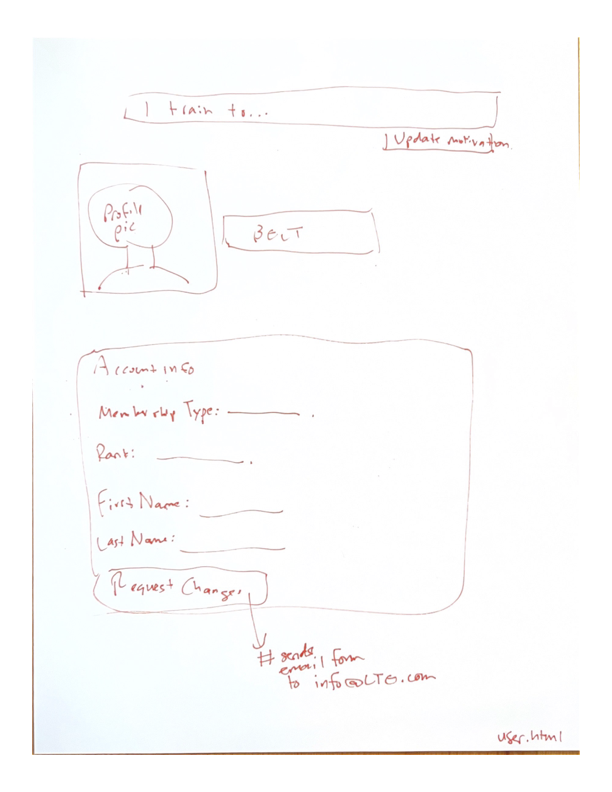

# Design Document

## Learn Train Evolve: A Modern Jiu Jitsu Management Software

## 1. Problem Statement

Brazilian Jiu Jitsu (BJJ) is growing in popularity with academies opening to meet the surging demand. The sport of jiu jitsu is unique in its combined mental and physical complexity. Likened to "chess with your body", jiu jitsu requires practitioners to understand movements, attacks and defenses from common positions. Upon this basic framework (how pieces move) come combinations, sequences, strategy and tactics. However, knowing the move intellectually is only half of the game, because your body has to be able to execute the move with precise technique and timing, requiring coordinated movements that become muscle memory with routine practice. The complexity of the sport presents a problem: *how can practitioners manage and optimize their learning and training process?*

 
Jiu jitsu practitioners commonly track what they are learning, how it fits into their existing knowledge base, and what they need to learn next. At more beginner levels, this tracking is primarily executed by the curriculum, but as students become more intermediate, they must take more ownership of their development. Students use many systems for tracking their progress, including physical notebooks, a note on a smartphone, excel sheets, word docs, etc. **Students would benefit from an integrated system where they can organize their training notes, set goals, and track progress on a platform that is integrated with their academy, their gym schedule and curriculum, and their teammates+coaches.** 

Learn Train Evolve provides athletes an integrated platform to track and manage training, technique development, goals, and coaching. 
Aps like ZenPlanner and MindBodyConnect offer academy owners well developed technology for managing their memberdatabase and traking
data analytics about their members. However, the member-facing application is lacking and does not support a member viewing their own
training data and organizing information pertaining to training, technique development, and goals.

With two types of users (students + administrators), admins can syn the calendar for now, with the eventual idea being to integrate this software
with a third party CRM like ZenPlanner. Students gain the real functionality: they can manage their own training plan and collect notes and resources in one convenient location. 

## 2. Top Questions to Resolve in Review


## 3. Vocabulary and User Stories

- User: A student of the jiu-jitsu academy
- Student: may be used synonymously with user, especially when talking about students vis-a-vi the administrator or other users.
- Administrator: A coach/owner of the academy who will have administrative access to the site, including the ability to upload content, read access to parts of students profiles, CRUD activities for "users".
-Academy: The school where the users train. 

### User stories by category

_Administrative work would be best handled by a third party CRM, such as ZenPlanner. The focus of this application is improving the user/student experience. For demonstration purposes, I will handle this basic functionality for the academy owner via Cognito. 
In practice, they would purchase a software for owner-side management and this functionality would be outsourced to that. The final UC on this list, maintaining a database of past/future taining sessions, would be handled by making API calls to the CRM of choice, ie ZenPlanner or SalesForce._

- B: 
	**Basic Admin Functionality will be handled by Cognito for now**
	* UC. As an administrator, I want to add new students to my academy. (B)
	* UC. As an administrator, I want to remove students from my academy. (B)
	* UC. As an administrator, I want to update information about one of my students. (B)
    * UC. As an administrator, I want to view the training history for any of my students. (T) [Third party integration...not the responsibility of this app]
	* UC. As an administrator, I want to see who has signed up for a class (present moment to one week out) or who has attended a class (past class). (T) [Third party integration...not the responsibility of this app]

## These user stories will form the foundation of my capstone MVP.
- T: 
	**Functionality associated with TRAIN component**
	* UC. As an administrator, I want to use my google calendar to maintain the database of past and future training sessions (B).
	* UC. As a user, I want to be able to sign up for a class. 
    * UC. As a user, I want to update information about a class I have attended (T).
	* UC. As a user, I want to be able to view my past training, and sort my training by different variables on a user friendly data analytics dashboard. (T)
	* UC. As a user, I want to be able to interact with my academy community by posting messages in a social channel. (T) (stretch)
- E:
  **functionality associated with EVOLVE component** _Will move to these if the above "Train" UCs are satisfied, excluding the stretch_
	* UC. As a user, I want to be able to select a goal from a list of suggestions. (E)
	* UC. As a user, I want to be able to create a new goal. (E)
	* UC. As a user, I want to be able to update a goal, including making notes or marking the goal as completed.  (E)
	* UC. As a user, I want to be ablve to view my completed, ongoing, and future goals. (E)

- L: 
	**functionality associated with LEARN component**
	* UC. As an administrator, I want to update content on the website, like add photos, post events, and upload video resources. (L)
	* UC. As a user, I want to view resources to enable my learning. (L)
	* UC. As a user, I want to view video of the techniques taught that week. (L)
	* UC. As a user, I want to create notes about techniques I am learning. (L)


## 4. Project Scope

### 4.1. In Scope

In this design I will solve the problem of jiu jitsu practitioners needing the ability to organize information about their training. For this first iteration of the project I will focus on the *TRAIN* thread of "Learn, Train, Evolve". Users will be able to sign up for training sessions, view their training sessions, sort their training sessions, and add notes to their training sessions. 


### 4.2. Out of Scope

- To manage the scope, this initial iteration will not yet support the "learn" and "evolve" functionality. Those will come in phase 2 and phase 3.

# 5. Proposed Architecture Overview

An important element of this design is that it is separated into three key components: learn, train, and evolve. 
- The LEARN component will cover use cases related to notes on training and accessing resources. 
- The TRAIN component will cover use cases related to scheduling training sessions, recording data about training sessions, and viewing a history of training sessions (data analytics will be available such as volume by week, by type, by day, etc).
- The EVOLVE component will cover use cases related to goal setting and reflection. 

In this way, concerns are separated and the project can be developed incrementally. Phase 1 (this phase) will tackle the TRAIN component.

Users will be managed and stored in Cognito.

TrainingSession and UserTrainingSession data will be stored in DynamoDB. 

On the backend, the application will receive a request, and an activity class will handle the request. Handling the request will entail parsing the request, interacting with a DAO, and creating/returning a response object. The DAO will serve as a class to manage all data access through DynamoDB. 

The front end will accept the user input and create the request to pass to the application. 

The front end will receive the response object and display the output accordingly. 

Each thread "LEARN, TRAIN, EVOLVE" will have representation on the application home page, and each will have their own page where full functionality of that element of the design lives. For example, a user can see their upcoming training on the home page, but to view training, make notes, and sort training, they will navigate to the TRAIN page. 


# 6. API

## 6.1. Public Models

```
{
	// UserModel
	
	String email; --> unique identifier for each member
	String name
	String membership;
	String rank;
	} 
```

```
{
	// TrainingSessionModel

	String eventId; (id for session/event resource)
	Start start;
	End end;
	String type;
	Boolean isCancelled;
	}
```

```
{
	// UserTrainingSessionModel

	String email; (id for user)
	String eventId; (id for session/event resource)
	Date date;
	String type;
	Double intensityRating;
	int techniqueEnjoyment;
	int performanceRating;
	int noteNumber;
	int goalNumber;
	Set<String> tags;
	Boolean attended;
	}
```


```
{
	// Goal

	String email;
	int goalNumber;
	String goalTitle;
	LocalDate dateCreated;
	String goalContent;
	String goalStatus;
	Set<String> taskList;
	Set<String> tags;
}
```

```
{
	//Note

	String email;
	int noteNumber;
	String noteTitle;
	String noteContent;
	LocalDate dateCreated;
	Set<String> tags;
	String eventId; (corresponding training session if applicable)
	}
```


## API ENDPOINTS

See [API documentation](openapi.json)

See [SyncTrainingSessions endpoint sequence diagram](SyncTrainingSessionsSequenceDiagram.puml)
See [GetTrainingSession endpoint sequence diagram](GetTrainingSessionSequenceDiagram.puml)
See [UpdateUserTrainingSessionSequenceDiagram endpoint sequence diagram](UpdateUserTrainingSessionSequenceDiagram.puml)
See [UML diagram here](LearnTrainEvolve.puml)

# 7. Tables

Phase one will encompass the TrainingSessions and UserTrainingSessions tables stored in DynamoDB. 


7.1 `TrainingSessions`

```
eventId // primary key, S
start // S 
end // S
type // S
isCancelled // BOOL

```

7.3 `UserTrainingSessions`

```
email // partion key, S
eventId // sort key, S
type // S
date // S
intensityRating // N
techniqueEnjoyment // N
performanceRating // N
noteNumber // N
goalNumber // N
tags // SS
attended // BOOL

```

7.4 `Notes`

```

email // partion key, S
noteNumber // sort key, N
noteTitle // S
noteContent // S
dateCreated // S
tags // SS
eventId // S

```
7.4 `Goals`

```

email // partion key, S
goalNumber // sort key, N
dateCreated // S
goalTitle // S
goalContent // S
goalStatus // S
tags // SS
taskList // SS

```
# 8. Pages





# 9. Technologies 

- The backend will be written in Java. 
- I will use AWS API Gateway and AWS Lambda to run the application.
- I will use Amazon Cognito to add users and update users -- admin can do this only. 
- I will use DynamoDB for data storage. 
- For the training analytics, I will use Amazon Athena AWS Athena DynamoDB connector to query the tables with SQL. 
- The front end will use JavaScript with a React framework. 
- I will integrate google cal API for the scheduling functionality. 

Within React I envision the following components to begin with: 
- Header
- Footer 
- AdminDashboard (for syncing data)
- NavMenu
- TrainingSessions (Learn, Train, or Evolve, will have nested comonents based on what it is)
- Schedule 
- TrainingSession 
- Note 
- Resource 


